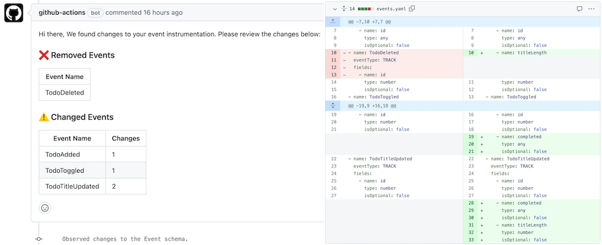

# Event Analytics Monitoring Action

This action monitors for any breaking changes to the analytics tracking code. With this action, product engineering teams can change tracking code with full transparency in collaboration with data consumers! 

The action analyzes the code commits and shows possible breaking changes to the structure (schema) of analytics events. It currently supports Typescript projects that use the Segment, Amplitude, MixPanel, or Google Analytics analytics SDKs. Besides showing a summary of changes on the Pull Request, the action automatically extracts and stores the event schema in the `events.yaml` file in your repo. You can leverage this file to monitor changes, set up alerts, or require stakeholder approvals e.g. via a [CODEOWNERS](https://docs.github.com/en/repositories/managing-your-repositorys-settings-and-features/customizing-your-repository/about-code-owners) file.



## Getting Started

Create a Github workflow file in your repo at `.github/workflows/syft.yml` with the contents below and commit/push the change to the main branch. Now whenever Syft detects changes to the tracking instrumentation, it will alert you to schema changes on the Pull Request! 🚀 

```yaml
on: [pull_request]

jobs:
  syft-analysis:
    permissions: write-all
    runs-on: ubuntu-latest
    name: Syft Event Analysis.
    steps:
      - uses: actions/checkout@v3
        with:
          repository: ${{ github.event.pull_request.head.repo.full_name }}
          ref: ${{ github.event.pull_request.head.ref }}
      - uses: actions/setup-node@v3
        with:
          node-version: "18.x"

      - name: Extract Schema
        uses: syftdata/monitor-action@v0.0.1
        with:
          github_token: ${{ secrets.GITHUB_TOKEN }}

      - name: Create commit with Schema file
        uses: EndBug/add-and-commit@v9
        with:
          author_name: Syft Analysis Bot
          author_email: syft-analysis@syftdata.com
          message: "Observed changes to the Event schema."
          add: "events.yaml"
```

## Configuration

The action provides two optional parameters: `project_directory` and `output_directory`. By default, both parameters point to the root of your project directory.

#### Project Directory

If your project code resides in a subdirectory within the repository, you can customize the action using the `project_directory` parameter. For example, if your project is located under `packages/your-app`, change the workflow file to:

```yaml
---
- name: Extract Schema
  uses: syftdata/monitor-action@v0.0.1
  with:
    project_directory: packages/your-app
```

#### Output Directory

If you prefer to store the event schema file under a custom artifact directory, you can customize the action using the `output_directory` parameter. For instance, if you want the artifact to be placed under `artifacts/schemas/`, modify the workflow file thus:

```yaml
---
- name: Extract Schema
  uses: syftdata/monitor-action@v0.0.1
  with:
    output_directory: artifacts/schemas/
```

## Monitoring

To notify stakeholders about changes to the events.yaml file that is generated under the output_directory, you can add a CODEOWNERS file.

## Supported Analytics SDKs

The Action currently supports the following Analytics SDKs in TypeScript:

- Amplitude
- Segment
- Mixpanel
- Google Analytics

## Feedback and Contributions
If you find this action useful, please ⭐️ the [github repo](https://github.com/syftdata/monitor-action). Please see the [CONTRIBUTING](CONTRIBUTING.md) guide to submit changes to the repo. For feature requests or bug reports, please open an issue in the github repository. For general feedback, please feel free to drop us a note at hello@syftdata.com! 👋 

## License
Apache License 2.0